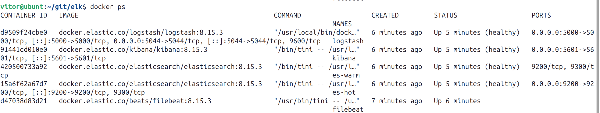
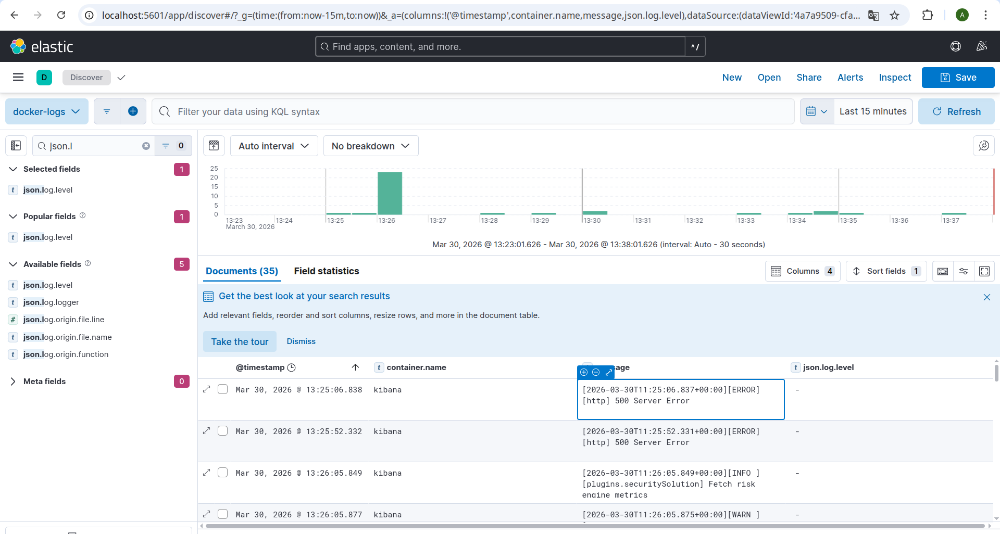
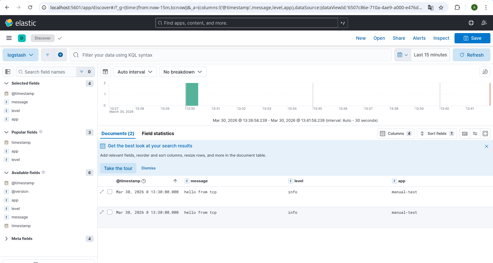

# Домашнее задание по ELK

Выполнен ELK-стек в Docker без использования директории `help`.

Состав стека:

- `es-hot`
- `es-warm`
- `logstash`
- `kibana`
- `filebeat`

## Скриншоты

Скриншот `docker ps` через 5 минут после старта контейнеров:

Скриншот интерфейса Kibana с логами Docker:

Скриншот интерфейса Kibana с индексом `logstash-*`:

## Файлы решения

- [docker-compose.yml](docker-compose.yml)
- [filebeat/filebeat.yml](filebeat/filebeat.yml)
- [logstash/pipeline/logstash.conf](logstash/pipeline/logstash.conf)

## Что реализовано

- Поднят кластер Elasticsearch из двух нод: `hot` и `warm`
- Logstash принимает JSON-сообщения по TCP на порту `5000`
- Filebeat собирает docker-логи хоста и отправляет их в Logstash
- В Elasticsearch создаются индексы:
  - `docker-logs-*`
  - `logstash-*`
- В Kibana созданы data views и проверено отображение логов в `Discover`
